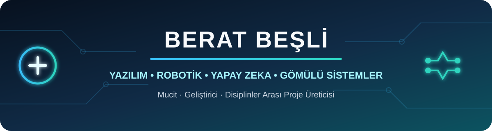

  

## Merhaba, ben Berat 👋

Yazılım, robotik, yapay zeka ve gömülü sistemlerle uğraşıyorum. Bir fikri sadece düşünce olarak bırakmak yerine çalışır bir prototipe dönüştürmek en sevdiğim kısım.

Bugüne kadar bilgisayar, makine ve mekatronik mühendisleriyle projeler geliştirdim. Yarışmalar, hackathonlar ve bilim fuarları da bana hem ekip çalışmasını hem de kısa sürede çözüm üretmeyi öğretti.

> **English:** Developer and young inventor interested in software, robotics, AI and embedded systems.

## 🧠 Patent başvurusu

Gülnıhal Aktaş ile geliştirdiğimiz **Akıllı Giysi ve Dokunsal Biyogeribildirim Sistemi** için yaptığımız başvuru, `TR 2026 008928 A2` numarasıyla yayımlandı. Kısaca proje; stres takibi yapabilen ve gerektiğinde dokunsal uyarı veren giyilebilir bir sistem.

🔗 [Projenin arayüz prototipi ve yayımlanan başvuru belgesi](https://github.com/beratbesli/akilligiysiapp)

Ayrıca şu anda detaylarını henüz paylaşamadığım **bir patent başvurum daha** süreçte.

## 🛠️ Öne çıkan projeler

| Proje | Odak | Kısa açıklama |
| --- | --- | --- |
| [Akıllı Giysi Sağlık Monitörü](https://github.com/beratbesli/akilligiysiapp) | Giyilebilir sağlık teknolojileri | EKG, nabız ve stres senaryolarını gösteren mobil öncelikli arayüz prototipi |
| [A.Y.U.S.](https://github.com/beratbesli/A.Y.U.S.) | Afet teknolojileri ve görüntü işleme | TUA Astro Hackathon için geliştirilen risk haritası ve tahliye rotası prototipi |
| [AyranOS](https://github.com/beratbesli/AyranOS) | İşletim sistemleri | C ve NASM ile geliştirilen, BIOS üzerinden açılan deneysel 32-bit x86 işletim sistemi |
| [Ayran-Network](https://github.com/beratbesli/Ayran-Network) | Ağ gözlemlenebilirliği | Linux için süreç bazlı bağlantı ve bant genişliği takibi sunan terminal arayüzü |
| [Türkçe Wikipedia FTS5 Arama Motoru](https://github.com/beratbesli/wikipedia-fts5-arama-motoru) | Arama motoru ve veri işleme | Türkçe Wikipedia üzerinde SQLite FTS5 ve BM25 ile hızlı yerel arama |

## 🏆 Yarışmalar, hackathonlar ve bilim etkinlikleri

### Finalistlikler ve dereceler

- **TEKNOFEST 2021 - İnsanlık Yararına Teknoloji Yarışması:** finalist.
- **TEKNOFEST 2022 Karadeniz - Eğitim Teknolojileri Yarışması:** finalist.
- **TUA Astro Hackathon:** A.Y.U.S. projesiyle katılım ve **ilk 5** içinde yer alma.

### Ulusal ve uluslararası katılımlar

- **Uluslararası ODTÜ Robot Günleri:** iki farklı takım bünyesinde yarışma deneyimi.
- **The Blueprint Uluslararası Hackathon:** katılım.
- **FIRST LEGO League 2022 - Cargo Connect:** 18. sezon, 3. Ortaokul Yerel Turnuvası katılımı.
- **Kanguru Fen Yarışması 2022:** Türkiye finalleri katılımı.
- **TÜBİTAK 4006-A ve 4006-C Bilim Fuarları:** proje ve fuar katılımı.
- **2023 Edirne Eğitim Vizyonu - Tasarım Beceri Atölyeleri:** yarışma katılımı.

## 🎓 DENEYAP eğitimleri ve sertifikaları

Edirne DENEYAP Teknoloji Atölyesi'nin **ilk dönem öğrencilerinden ve mezunlarından biriyim**. Burada farklı alanları deneyerek hangi teknolojilerle çalışmayı sevdiğimi keşfetme fırsatım oldu.

- Robotik ve Kodlama
- Elektronik Programlama ve Nesnelerin İnterneti
- Yazılım Teknolojileri
- İleri Robotik
- Malzeme Bilimi ve Nanoteknoloji
- Yapay Zeka
- Enerji Teknolojileri
- Mobil Uygulama
- Havacılık ve Uzay Teknolojileri
- Tasarım ve Üretim
- Siber Güvenlik

## 🎤 Konuşmalar, programlar ve teknoloji ekosistemi

- **T.C. Millî Eğitim Bakanlığı Girişimcilik ve Öğrenci Çalıştayı:** konuşmacı katılımı.
- **MEB Maziden Atiye Programı - Edirne:** katılım.
### Benim için özel buluşmalar

**Selçuk Bayraktar'la yüz yüze konuşma fırsatı bulmak** benim için gerçekten özel bir deneyimdi. Ayrıca **ASELSAN Akademi Başkanı** ve **Edirne Teknopark Genel Müdürü** ile de tanışıp teknoloji ve proje geliştirme üzerine sohbet ettim.

## ⚙️ Çalıştığım alanlar

- Gömülü sistemler, sensörler ve elektronik prototipleme
- Robotik, mekanik entegrasyon ve kontrol sistemleri
- Yapay zeka ve görüntü işleme
- İşletim sistemleri ve düşük seviyeli programlama
- Ağ izleme, Linux araçları ve siber güvenlik
- Web, mobil ve masaüstü uygulama geliştirme
- Teknik dokümantasyon, sunum ve takım koordinasyonu

## 🤝 İş birliği

Yeni fikirler üretmeyi ve farklı alanlardan insanlarla çalışmayı seviyorum. Bir proje, yarışma ekibi veya açık kaynak fikri için benimle GitHub üzerinden iletişime geçebilirsin.

