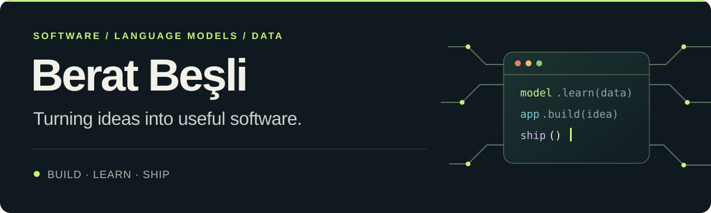

  

I’m a software developer interested in **language models, data-intensive applications, and tools people can actually use**. My projects range from AI-assisted web products and desktop applications to search engines and low-level systems.

I enjoy turning an idea into a complete product: shaping the interface, designing the backend, working with data, and making the result reliable enough to run outside a demo.

### What I’m building

<table>
<tr>
<td width="50%" valign="top">
<h3><a href="https://github.com/beratbesli/silent_churn">Silent Churn ↗</a></h3>

An AI-assisted early warning system that finds changes in customer sentiment across emails and reviews. Supports local and cloud language models.

React · FastAPI · LLMs · SQLite
</td>
<td width="50%" valign="top">
<h3><a href="https://github.com/beratbesli/Ayran-Notes">Ayran Notes ↗</a></h3>

A polished Markdown writing app for Linux with live preview, full-text search, autosave, and local Git-backed version history.

Python · PyQt6 · UX · Git
</td>
</tr>
<tr>
<td width="50%" valign="top">
<h3><a href="https://github.com/beratbesli/turkish-markov">Turkish Markov ↗</a></h3>

A streaming, disk-backed language modeling toolkit built to process multi-gigabyte Turkish corpora without loading them into memory.

Python · NLP · SQLite · Multiprocessing
</td>
<td width="50%" valign="top">
<h3><a href="https://github.com/beratbesli/wikipedia-fts5-arama-motoru">Turkish Wikipedia Search ↗</a></h3>

A local search engine with Turkish-aware text normalization, SQLite FTS5, and BM25 relevance ranking.

Python · Search · Data processing
</td>
</tr>
</table>

**Also exploring:** [3D weather & ocean telemetry](https://github.com/beratbesli/weatherminus) · [wearable health interfaces](https://github.com/beratbesli/akilligiysiapp) · [operating systems](https://github.com/beratbesli/EfesOS) · [on-device language models](https://github.com/beratbesli/esp32_s3-Turkce-LLM)

### Skills

| Area | Tools & experience |
| --- | --- |
| **Language models & NLP** | LLM integration, local inference, sentiment analysis, tokenization, Turkish text normalization |
| **Application development** | Python, JavaScript/TypeScript, React, FastAPI, PyQt6, REST APIs |
| **Data & search** | SQLite, FTS5, BM25, data pipelines, large-corpus processing, multiprocessing |
| **Engineering foundations** | Git, Linux, testing, C/C++, systems programming, embedded development |

### Education & training

I’m a graduate of the inaugural cohort of **DENEYAP Technology Workshops in Edirne**, where I completed project-based training across:

- **Software & AI:** software technologies, artificial intelligence, mobile applications, and cybersecurity
- **Robotics & electronics:** robotics and coding, advanced robotics, electronic programming, and IoT
- **Design & engineering:** design and production, energy technologies, materials and nanotechnology, aviation and space technologies

The program gave me a broad engineering foundation; today I focus that background on software, language technologies, and data-driven products.

---

I’m open to collaborating on useful software, applied AI, and open-source tools. If one of these projects interests you, feel free to start a discussion.
